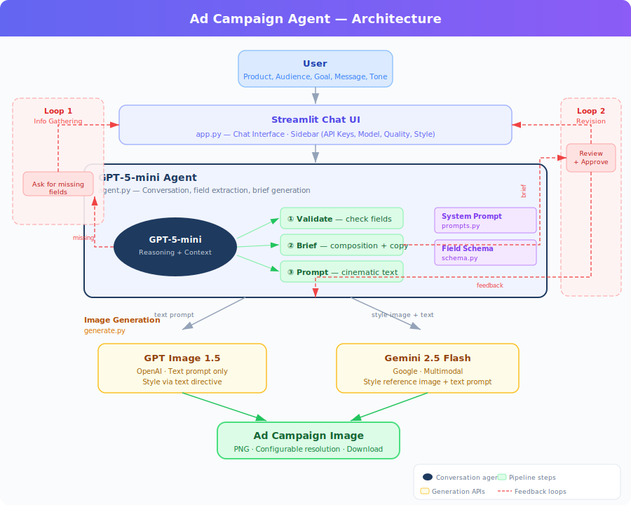

# Ad Campaign Agent

An AI-powered ad campaign creative tool built with Streamlit. Describe your product and campaign idea — the agent collects requirements, generates a creative brief, and produces an ad image.

**Live demo:** [ad-campaign-agent.streamlit.app](https://ad-campaign-agent.streamlit.app)

## How It Works

1. **Choose a model** — GPT Image 1.5 (default) or Gemini 2.5 Flash
2. **Pick a visual style** — 6 curated style presets
3. **Describe your campaign** — product, audience, goal, message, tone
4. **Review the creative brief** — edit or approve
5. **Generate** — the agent builds an optimized prompt and generates your ad image

## Architecture

<p align="center">
  
</p>

### File Structure

```
app.py          Streamlit UI — chat interface, sidebar controls, generation flow
agent.py        GPT-5-mini agent — conversation, field extraction, brief parsing
prompts.py      System prompt — pipeline rules, brief format, behavior
generate.py     Image generation backends — OpenAI and Gemini APIs
schema.py       Field definitions, style presets, validation
style/          Style reference images (6 presets)
```

## Setup

### Prerequisites

- Python 3.10+
- An OpenAI API key ([get one here](https://platform.openai.com/api-keys))
- (Optional) A Gemini API key ([get one here](https://aistudio.google.com/apikey))

### Install & Run

These commands work on **both macOS and Windows**:

```bash
git clone https://github.com/zikunye2/ad-campaign-agent.git
cd ad-campaign-agent
pip install -r requirements.txt
streamlit run app.py
```

> **Windows note:** Make sure Python and Git are installed and added to your PATH.
> If `pip` doesn't work, try `pip3` or `python -m pip`.
>
> **New to Git?** See GitHub's official getting started guide:
> [docs.github.com/en/get-started](https://docs.github.com/en/get-started/start-your-journey)

Enter your API key(s) in the sidebar and start chatting.

### API Key Safety

API keys are entered in the browser and stored **only in your session memory**. They are never saved to disk, logged, or sent anywhere except to the OpenAI/Google APIs. When you close the tab, keys are gone.

## Models

| Model | API | Style Reference | Notes |
|-------|-----|-----------------|-------|
| **GPT Image 1.5** | OpenAI | Text description only | 3 quality tiers (low/medium/high), configurable resolution |
| **Gemini 2.5 Flash** | Google | Image + text (native) | Multimodal LLM, uses style image directly |

## For Students

This repo is designed for you to download, run locally, and extend.

### Getting Started

1. **Download the code** — `git clone` (above) or download as ZIP from the green **Code** button on GitHub
2. **Install dependencies** — `pip install -r requirements.txt`
3. **Run it** — `streamlit run app.py`
4. **Make changes** — edit the Python files, save, and Streamlit auto-reloads
5. **Show your work** — screenshot the app, explain what you changed and why

> **New to GitHub / Git?** You don't need an account to download and run this. Just click the green **Code** button > **Download ZIP**. If you'd like to learn Git, check out GitHub's official guide: [docs.github.com/en/get-started](https://docs.github.com/en/get-started/start-your-journey)

### Project Ideas

Here are some directions you can take. Pick one or combine a few:

**UI / UX Improvements**
- Redesign the chat interface or sidebar layout
- Add dark mode or custom themes
- Show a history of generated images
- Add a comparison view for different style presets

**Prompt & Brief Design**
- Improve the system prompt for better creative briefs
- Add new fields (e.g. brand colors, logo placement, seasonal theme)
- Experiment with different prompt structures for image generation
- Add prompt templates for specific industries (fashion, tech, food)

**New Tools & Features**
- Add a new image generation backend (e.g. Stability AI, Flux, DALL-E 3)
- Add video generation (e.g. Sora, Veo, Runway)
- Add multi-image generation for A/B testing
- Add image editing / refinement after generation

**Post-Generation Enhancements**
- Add feedback-based iteration (user rates the image, agent improves)
- Add text overlay editing (adjust headline position, font, size)
- Export in multiple formats or sizes
- Generate campaign analytics or audience insights

**New Style Presets**
- Drop a PNG in `style/`, add an entry to `STYLE_PRESETS` in `schema.py` — that's it

## License

MIT
